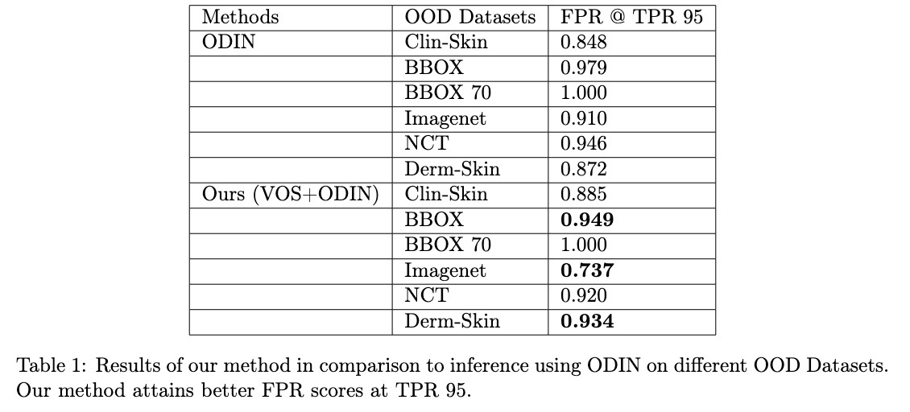
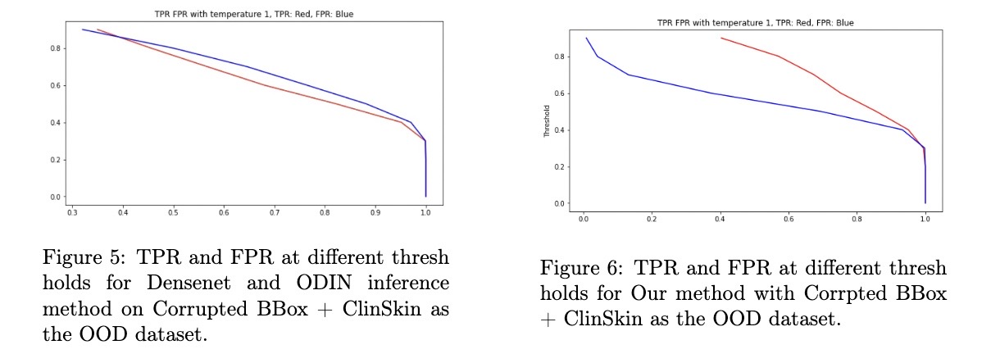

# Out-of-Distribution-Detection-for-Skin-Lesion-Classification
As part of the Deep Learning (CS F425) course project we have implemented "VOS: LEARNING WHAT YOU DON’T KNOW BY
VIRTUAL OUTLIER SYNTHESIS".

[Report](https://drive.google.com/file/d/1U_0OpxobWALTOzKO4xflq9eg0fTBgSMl/view?usp=sharing)

## Abstract

Deep Neural Network models for skin lesion detection lack supervision from unknown data
and as a result, produce overconfident results on Out-Of-Distribution data. VOS (Virtual
Outlier Synthesis) is a novel framework that detects OOD examples by adaptively synthesizing
virtual outliers that can meaningfully regularize the model’s decision boundary during training.
Specifically, VOS samples virtual outliers from the low-likelihood region of the class conditional
distribution estimated in the feature space. It also introduces a novel unknown-aware training
objective, which contrastively shapes the uncertainty space between the In-Distribution data
and synthesized outlier data. In this work, we study the problems dealing with OOD data
for skin cancer classification and compare the performance of VOS with other State-of-the-art
methods.

## Datasets

  In Distribution Dataset
  * HAM 10000 

  Out-Of-Distribution Datasets
  * Derm Skin
  * Clin Skin
  * BBOX
  * BBOX 70
  * NCT
  * Imagenet

## Deep Learning Architectures for training on ID dataset
  * Resnet50
  * VGG
  * Densenet : DenseNet attained the best result among the 3 DNN models tested on. 82.98% validation accuracy after training for 8 epochs (due to compute limitations).
  
## Pitfalls of DNN
   ### OOD Data
   A trained deep neural network which performs very accurately on the In-Distribution fails when tested on Out-Of-Distribution data. This serves as the    motivation for dedicated OOD training paradigm for this problem of skin lesion detection. Having such a method in place is of atmost importance          whilst deploying such models in the medical domain.

## Relevant existing OOD methods
  ### ODIN - "ENHANCING THE RELIABILITY OF OUT-OF-DISTRIBUTION IMAGE DETECTION IN NEURAL NETWORKS"
  Paper: [ODIN](https://arxiv.org/pdf/1706.02690.pdf)
  
## VOS: LEARNING WHAT YOU DON’T KNOW BY VIRTUAL OUTLIER SYNTHESIS
  Paper: [VOS](https://openreview.net/pdf?id=TW7d65uYu5M)
  
## Ours (Training using outlier synthesis and using ODIN inference method)

We have implemented VOS virtual outlier synthesis strategy on the Densenet that we have built
to tackle this problem. This coupled with the inference method from ODIN, proves to out-perform
other OOD methods listed in literature for Skin Lesion OOD detection. We also observe that
keeping the temperature scaling factor to 1 during inference gives the best results.

## Results

## Our contributions

* Identifying the problem of OOD data in the current Skin cancer classifiers and attempting to alleviate it using current SOTA OOD detection algotithms.
* Combining the training method proposed in VOS using outlier synthesis with the promising inference methods proposed in ODIN.
* Studying the effects on different OOD datasets.

## Possibilities of future work

* We believe that VOS requires longer epochs of training since virtual outliers can only be efficiently sampled from the low-likelihood regions only after the distribution has been learned sufficiently well. Training using this strategy does seem to improve the results, however, we would want to train for longer epochs.
* Using the OOD prediction branch of VOS and doing inference using it might work well, if we train VOS for longer epochs.
* Check if training for longer epochs does help our method outperform the current SOTA.

## Contributors:

* Hrithik Nambiar
* Vishwa Shah

